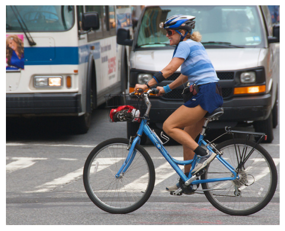
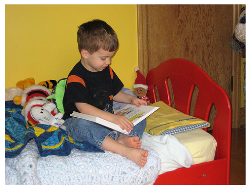
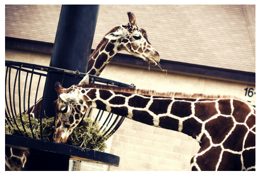

---

# CLIP-GPT

Initial exploration of fine-tuning GPT-2 for interleaved CLIP embedding input and output. The goal of this project is to showcase that GPT is able to directly reason across multiple modalities. 


## Data


This exploration makes use of MS-COCO's 2017 training image and caption pairs, which can be downloaded [here](https://cocodataset.org/#download).


## Fine-tuning

We provide a [notebook](notebooks/CLIP_GPT_COCO.ipynb) which details our experimental setup and fine-tuning procedure as well as the following [video description](https://youtu.be/LA3AC8gM6hw).

We will be continuing to elaborate and iterate on the method as we continue.


#
## Results

### Caption to CLIP
Using cosine similarity we compute the top-k nearest neighbors for a predicted embedding within the MSCOCO training image set.
| Caption      | COCO Nearest Neighbor |
| :---        |    :----:   |
| A woman riding a bike amongst other vehicles.| |
| A child reading a book. |   |


### CLIP to Caption
Captions produced after passing a CLIP embedding as input.
| Encoded Image | Caption |
|  :----: |    :----:   |
|  | A piece of cake and a fork on a table.|
|  | Two giraffes are standing next to a fence. |

## TODO

- [x] KNN on LAION index

## Acknowledgements

This project builds on methods and/or utilizes code from the following works/repos:
```
@inproceedings{wolf-etal-2020-transformers,
    title = "Transformers: State-of-the-Art Natural Language Processing",
    author = "Thomas Wolf and Lysandre Debut and Victor Sanh and Julien Chaumond and Clement Delangue and Anthony Moi and Pierric Cistac and Tim Rault and Rémi Louf and Morgan Funtowicz and Joe Davison and Sam Shleifer and Patrick von Platen and Clara Ma and Yacine Jernite and Julien Plu and Canwen Xu and Teven Le Scao and Sylvain Gugger and Mariama Drame and Quentin Lhoest and Alexander M. Rush",
    booktitle = "Proceedings of the 2020 Conference on Empirical Methods in Natural Language Processing: System Demonstrations",
    month = oct,
    year = "2020",
    address = "Online",
    publisher = "Association for Computational Linguistics",
    url = "https://www.aclweb.org/anthology/2020.emnlp-demos.6",
    pages = "38--45"
}

@article{radford2019language,
  title={Language Models are Unsupervised Multitask Learners},
  author={Radford, Alec and Wu, Jeff and Child, Rewon and Luan, David and Amodei, Dario and Sutskever, Ilya},
  year={2019}
}

@article{mokady2021clipcap,
  title={ClipCap: CLIP Prefix for Image Captioning},
  author={Mokady, Ron and Hertz, Amir and Bermano, Amit H},
  journal={arXiv preprint arXiv:2111.09734},
  year={2021}
}

@misc{beaumont-2022-clip-retrieval
  author = {Romain Beaumont},
  title = {Clip Retrieval: Easily compute clip embeddings and build a clip retrieval system with them},
  year = {2022},
  publisher = {GitHub},
  journal = {GitHub repository},
  howpublished = {\url{https://github.com/rom1504/clip-retrieval}}
}
```

- [CLIP](https://github.com/openai/CLIP)
- [MS-COCO](https://cocodataset.org/#home)
---